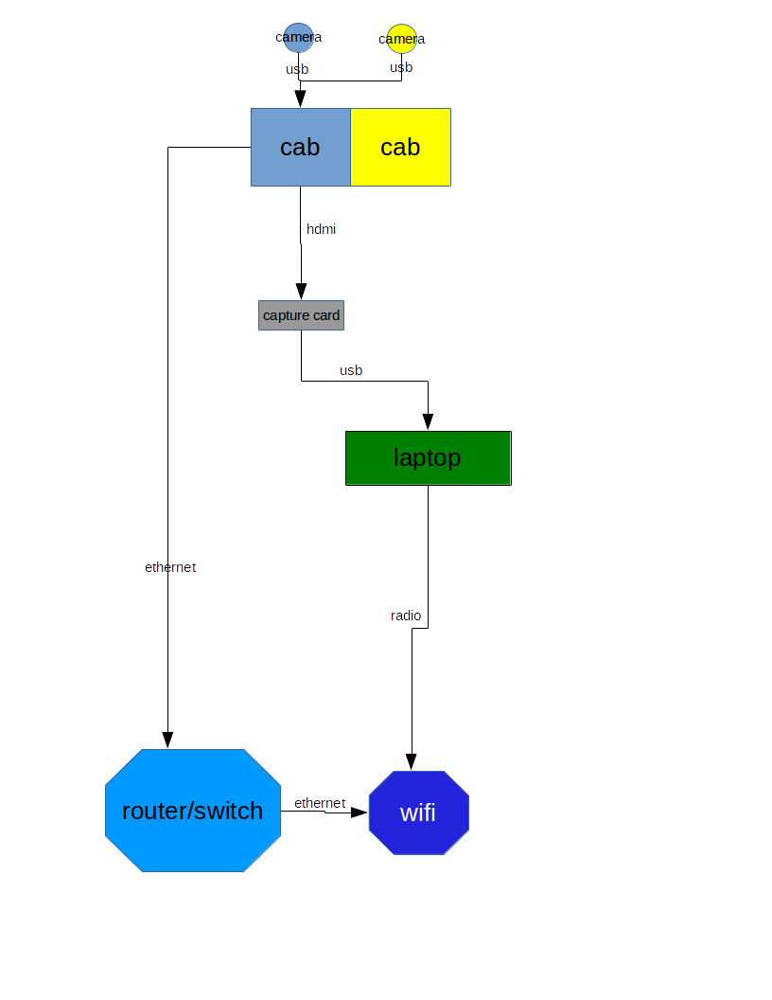

# Streaming setup

## cab setup
* Cab PC runs ffmpeg commands for each cab-cam, sending cam audio & video to localhost nginx rtmp service.

## laptop setup
* OBS uses capture card to get cab screen capture.
* OBS uses rtmp sources to get cab-cam inputs.

## Diagram

# Installation

[Install documentation](docs/install/readme.md)
